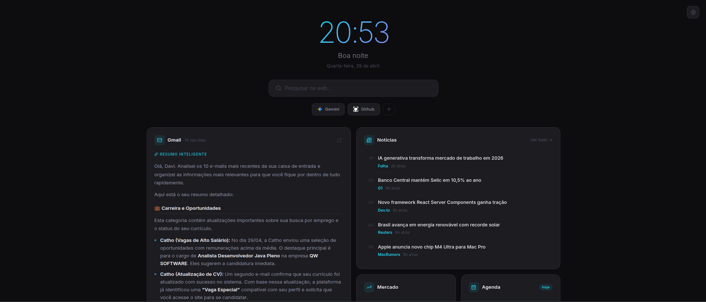

# Personal Dashboard Chrome Extension



A modern, beautiful, and highly functional Chrome extension that replaces your default new tab page with a customizable personal dashboard. Designed with a clean, modern aesthetic and powered by React, TypeScript, and Vite.

## 🌟 Features

- **New Tab Replacement**: Automatically overrides the default Chrome new tab with a personalized dashboard.
- **Gmail Integration with AI**: Seamlessly integrates with the Gmail API to fetch recent emails. Uses Google's Gemini AI to intelligently summarize your unread emails and display them in clean Markdown.
- **Quick Links & Speed Dial**: Easily access your most visited sites or custom-defined bookmarks.
- **Search Bar**: Convenient web searching directly from the dashboard.
- **Widgets System**:
  - **Gmail Widget**: AI-summarized email insights.
  - **Agenda Widget**: Keep track of your daily tasks and schedule.
  - **Invest Widget**: Quick view of your financial and investment data.
  - **News Widget**: Stay updated with the latest headlines.
- **Notes Module**: Take quick notes that persist across sessions.
- **Customizable Settings**: Configure your preferences, API keys (like Gemini), and widget visibility.
- **Modern UI/UX**: Built with Tailwind CSS v4 and Lucide React icons for a high-fidelity, polished, and minimalist design.

## 🚀 Tech Stack

- **Framework**: [React 19](https://react.dev/)
- **Language**: [TypeScript](https://www.typescriptlang.org/)
- **Styling**: [Tailwind CSS v4](https://tailwindcss.com/)
- **Build Tool**: [Vite](https://vitejs.dev/)
- **Icons**: [Lucide React](https://lucide.dev/)
- **Testing**: Vitest & React Testing Library
- **AI Integration**: Google Gemini API
- **APIs**: Chrome Extensions API (Storage, Identity, Bookmarks), Gmail API (OAuth2)

## 📦 Installation

### Prerequisites
- Node.js (v18 or higher recommended)
- npm or yarn

### Local Development

1. **Clone the repository:**
   ```bash
   git clone https://github.com/NavesDev/Personal-Dashboard.git
   cd Personal-Dashboard
   ```

2. **Install dependencies:**
   ```bash
   npm install
   ```

3. **Start the development server (for UI testing):**
   ```bash
   npm run dev
   ```

### Building for Chrome

1. **Build the extension:**
   ```bash
   npm run build
   ```
   This will compile the TypeScript, bundle the React application, and copy the `manifest.json` and icons into the `dist/` directory.

2. **Load into Chrome:**
   - Open Google Chrome and navigate to `chrome://extensions/`
   - Enable **"Developer mode"** in the top right corner.
   - Click **"Load unpacked"**.
   - Select the `dist` folder generated inside your project directory.

## ⚙️ Configuration

To use the Gmail and Gemini AI features, you will need to:
1. Provide a **Gemini API Key** in the extension's Settings panel to enable AI summaries.
2. Authenticate with your Google account when prompted by the Gmail widget (uses Chrome Identity API for secure OAuth2).

## 🧪 Testing

The project is equipped with unit and component tests using Vitest.
To run the tests:
```bash
npm run test
```
To run tests in watch mode:
```bash
npm run test:watch
```

## 📄 License

This project is licensed under the [MIT License](LICENSE).
